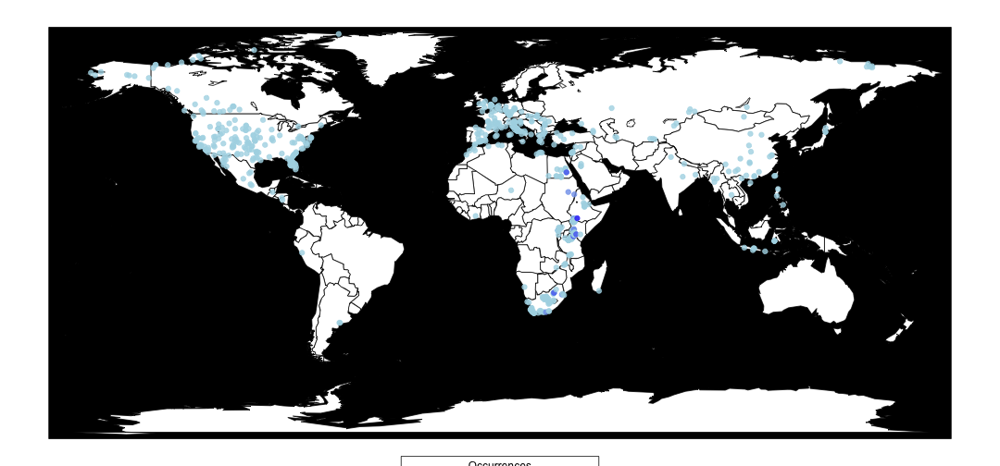
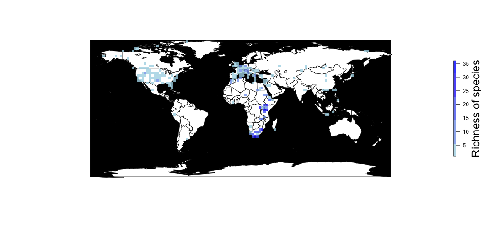
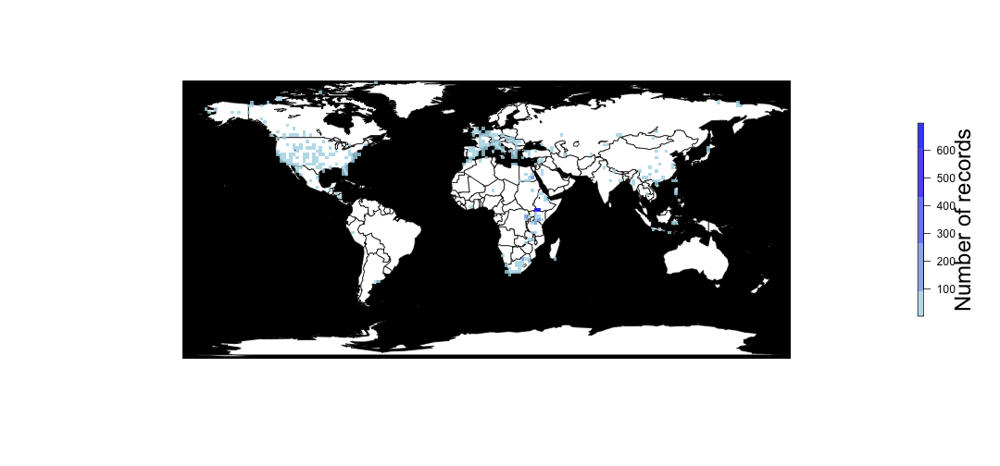
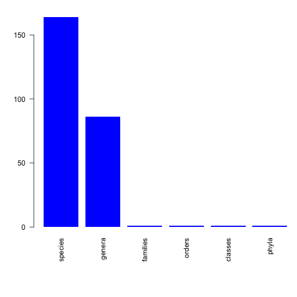
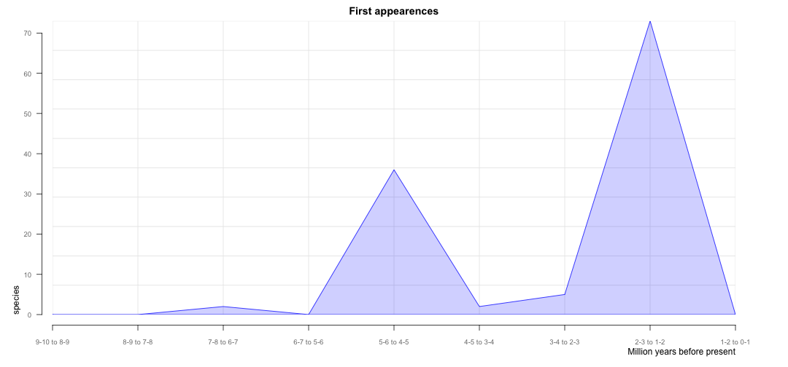
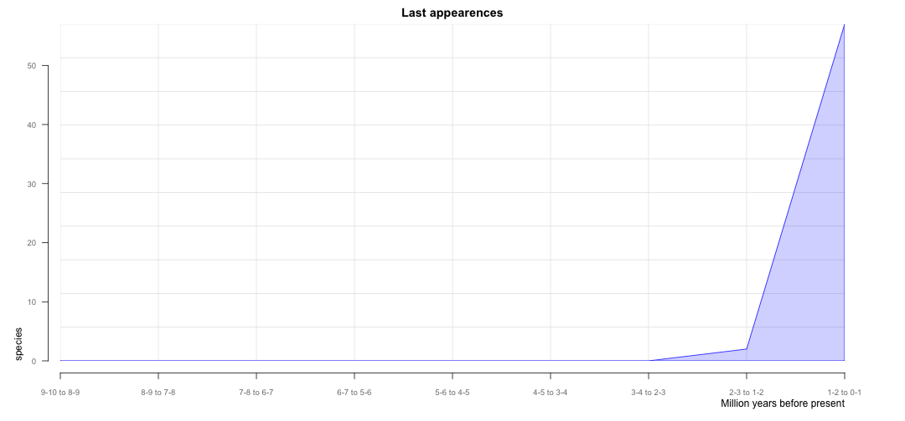
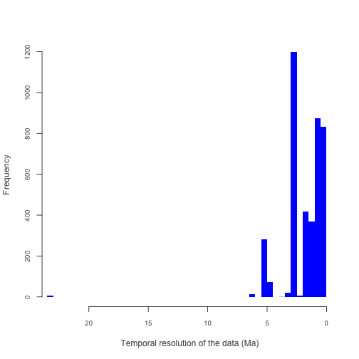
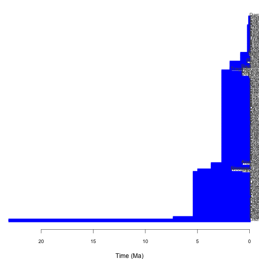

paleobiologyDB
==============

## Exploring the new R API to the paleobiologyDB.

Preliminary loading of required packages.  


```r
library(devtools)
library(maps)
library(raster)
if (!require(paleobioDB)) {
    install_github("ropensci/paleobioDB")
    library(paleobioDB)
}
```


Now we get all PaleobioDB occurrences for Quaternary bovids.  


```r
bovidae <- pbdb_occurrences(limit = "all", base_name = "bovidae", interval = "Quaternary", 
    show = c("coords", "phylo", "ident"))
head(bovidae)
```

```
##        oid typ   cid                      tna rnk    tid
## 1:1 138836 occ 11803              Gazella sp.   5  42774
## 1:2 138837 occ 11803        Dama mesopotamica   3 149388
## 1:3 150048 occ 13293          Bubalus bubalus   3  42755
## 1:4 150049 occ 13293   Megalovis guangxiensis   3  42796
## 1:5 150050 occ 13293 Capricornis sumatraensis   3 149670
## 1:6 150894 occ 13456                  Bos sp.   5  42753
##                    oei   eag    lag   rid    lng   lat     fml   fmn
## 1:1   Late Pleistocene 0.126 0.0117 10604  35.05 32.72 Bovidae 42742
## 1:2   Late Pleistocene 0.126 0.0117 10604  35.05 32.72 Bovidae 42742
## 1:3 Middle Pleistocene 0.781 0.0117  4412 111.57 22.77 Bovidae 42742
## 1:4 Middle Pleistocene 0.781 0.0117  4412 111.57 22.77 Bovidae 42742
## 1:5 Middle Pleistocene 0.781 0.0117  4412 111.57 22.77 Bovidae 42742
## 1:6   Late Pleistocene 0.126 0.0000  6077  87.00 23.50 Bovidae 42742
##              odn   odl      cll   cln      phl   phn         idt
## 1:1 Artiodactyla 87634 Mammalia 36651 Chordata 33815     Gazella
## 1:2 Artiodactyla 87634 Mammalia 36651 Chordata 33815        Dama
## 1:3 Artiodactyla 87634 Mammalia 36651 Chordata 33815     Bubalus
## 1:4 Artiodactyla 87634 Mammalia 36651 Chordata 33815   Megalovis
## 1:5 Artiodactyla 87634 Mammalia 36651 Chordata 33815 Capricornis
## 1:6 Artiodactyla 87634 Mammalia 36651 Chordata 33815         Bos
##              ids                          mna mra              oli  rss
## 1:1          sp.                         <NA>  NA             <NA> <NA>
## 1:2 mesopotamica Antilope (Dama) mesopotamica  NA             <NA> <NA>
## 1:3      bubalus                      Bubalus   5 Late Pleistocene <NA>
## 1:4 guangxiensis                    Megalovis   5 Late Pleistocene <NA>
## 1:5 sumatraensis                         <NA>  NA Late Pleistocene <NA>
## 1:6          sp.                         <NA>  NA         Holocene <NA>
##      rst eid  idf
## 1:1 <NA>  NA <NA>
## 1:2 <NA>  NA <NA>
## 1:3 <NA>  NA <NA>
## 1:4 <NA>  NA <NA>
## 1:5 <NA>  NA <NA>
## 1:6 <NA>  NA <NA>
```


## Map the bovids


```r
pbdb_map(bovidae)
```

 


## Map the richness


```r
pbdb_map_richness(bovidae, res = 3, rank = "species")
```

 

```
## class       : RasterLayer 
## dimensions  : 56, 123, 6888  (nrow, ncol, ncell)
## resolution  : 3, 3  (x, y)
## extent      : -180, 189, -84.43, 83.57  (xmin, xmax, ymin, ymax)
## coord. ref. : NA 
## data source : in memory
## names       : layer 
## values      : 1, 36  (min, max)
```


## Map sampling effort


```r
pbdb_map_occur(bovidae, res = 2)
```

 

```
## class       : RasterLayer 
## dimensions  : 85, 185, 15725  (nrow, ncol, ncell)
## resolution  : 2, 2  (x, y)
## extent      : -180, 190, -86.43, 83.57  (xmin, xmax, ymin, ymax)
## coord. ref. : NA 
## data source : in memory
## names       : layer 
## values      : 1, 698  (min, max)
```


## Plot the number of subtaxa in the data set 


```r
pbdb_subtaxa(bovidae, do.plot = TRUE)
```

 

```
##   species genera families orders classes phyla
## 1     164     86        1      1       1     1
```


## Origins and Extinctions

```r
pbdb_orig_ext(bovidae, rank = "species", orig_ext = 1, temporal_extent = c(0, 
    10), res = 1)
```

 

```
##             new ext
## 1-2 to 0-1    0  57
## 2-3 to 1-2   73   2
## 3-4 to 2-3    5   0
## 4-5 to 3-4    2   0
## 5-6 to 4-5   36   0
## 6-7 to 5-6    0   0
## 7-8 to 6-7    2   0
## 8-9 to 7-8    0   0
## 9-10 to 8-9   0   0
```

```r
pbdb_orig_ext(bovidae, rank = "species", orig_ext = 2, temporal_extent = c(0, 
    10), res = 1)
```

 

```
##             new ext
## 1-2 to 0-1    0  57
## 2-3 to 1-2   73   2
## 3-4 to 2-3    5   0
## 4-5 to 3-4    2   0
## 5-6 to 4-5   36   0
## 6-7 to 5-6    0   0
## 7-8 to 6-7    2   0
## 8-9 to 7-8    0   0
## 9-10 to 8-9   0   0
```


## Temporal resolution


```r
pbdb_temporal_resolution(bovidae)
```

 

```
## $summary
##    Min. 1st Qu.  Median    Mean 3rd Qu.    Max. 
##   0.012   0.684   1.500   1.740   2.580  23.000 
## 
## $temporal_resolution
##    [1]  0.1143  0.1143  0.7693  0.7693  0.7693  0.1260  0.1260  0.1260
##    [9]  0.1260  0.1260  0.1143  2.4620  0.0117  3.1000  3.1000  3.1000
##   [17]  1.5000  1.5000  1.5000  1.5000  1.5000  1.5000  1.5000  1.5000
##   [25]  1.5000  1.5000  1.5000  1.5000  1.5000  1.5000  1.5000  1.5000
##   [33]  1.5000  1.5000  1.5000  1.5000  1.5000  1.5000  1.5000  1.5000
##   [41]  1.5000  0.1143  1.5000  1.5000  3.1000  1.7880  1.5000  1.5000
##   [49]  1.5000  1.5000  3.1000  1.5000  1.5000  1.5000  1.7880  1.5000
##   [57]  1.5000  1.5000  1.5000  1.5000  1.5000  0.2880  1.5000  1.5000
##   [65]  1.5000  1.5000  1.5000  1.5000  0.1143  0.1143  0.1143  0.1143
##   [73]  0.1143  0.1143  0.1143  0.1143  0.1143  0.1143  0.1143  0.1143
##   [81]  0.1143  0.1143  0.1143  0.1143  0.1143  0.1143  0.1143  0.1143
##   [89]  0.1143  0.1143  0.1143  0.1143  0.1143  0.1143  0.1143  0.1143
##   [97]  0.1143  0.1143  0.1143  0.1143  0.1143  0.2880  0.1143  0.1143
##  [105]  0.1143  0.1143  0.1143  0.1143  0.1143  0.1143  0.1143  0.1143
##  [113]  0.1143  0.1143  0.1143  0.1143  0.7820  0.7820  0.7820  2.8190
##  [121]  2.8190  2.8190  2.8190  2.8190  2.8190  1.0250  1.0250  1.0250
##  [129]  1.0250  1.0250  1.0250  1.0250  1.0250  1.0250  1.0250  1.0250
##  [137]  1.0250  1.0250  1.0250  1.0250  1.0250  1.0250  1.0250  1.0250
##  [145]  1.0250  1.0250  1.0250  0.7820  0.7820  0.7820  0.7820  0.7820
##  [153]  0.1143  0.7820  1.0250  1.0250  1.0250  0.7820  1.8070  2.8190
##  [161]  0.7820  0.1143  2.8190  2.8190  2.8190  1.0250  5.3213  2.8190
##  [169]  2.8190  2.8190  2.8190  0.7820  2.8190  1.8070  1.8070  1.8070
##  [177]  0.7820  0.7820  1.0250  1.0250  1.0250  1.0250  0.7820  0.7820
##  [185]  0.7820  5.3213  5.3213  5.3213  5.3213  5.3213  5.3213  5.3213
##  [193]  5.3213  5.3213  5.3213  0.7820  0.7820  0.7820  2.8190  0.7820
##  [201]  0.7820  0.7820  0.7820  2.8190  2.8190  2.8190  2.8190  2.8190
##  [209]  2.8190  2.8190  1.0250  1.0250  5.3213  0.7820  2.8190  2.8190
##  [217]  0.7820  0.7820  4.5520  2.5763  2.5763  5.3213  4.5520  4.5520
##  [225]  4.5520  0.7820  5.3213  1.0250  2.8190  2.8190  0.7820  1.0250
##  [233]  1.0250  1.0250  1.0250  1.0250  1.0250  1.0250  5.3213  5.3213
##  [241]  5.3213  5.3213  5.3213  5.3213  5.3213  5.3213  1.0250  0.0117
##  [249]  4.5520  4.5520  4.5520  4.5520  4.5520  4.5520  4.5520  4.5520
##  [257]  4.5520  4.5520  4.5520  0.7820  0.7820  0.7820  0.7820  0.0117
##  [265]  0.0117  0.0117  0.0117  0.0117  0.0117  0.0117  0.0117  0.0117
##  [273]  0.0117  0.0117  0.0117  0.0117  0.0117  0.0117  0.0117  0.0117
##  [281]  0.0117  0.0117  0.0117  0.0117  0.0117  0.0117  0.0117  0.0117
##  [289]  0.0117  0.0117  0.0117  0.7820  0.7820  2.5763  2.5763  2.5763
##  [297]  2.5763  2.5880  2.5880  2.5880  2.5880  2.5880  2.5880  2.5880
##  [305]  2.5880  2.5880  2.5880  2.5880  2.5880  2.5880  2.5880  2.5880
##  [313]  2.5880  0.0117  2.5880  2.5880  2.5880  2.5880  2.5880  2.5880
##  [321]  2.5880  0.0117  0.0117  0.0117  0.0117  0.0117  2.5763  2.5763
##  [329]  2.5763  2.5763  2.5880  2.5880  0.0117  0.0117  0.0117  0.0117
##  [337]  0.0117  0.0117  0.0117  0.0117  0.0117  0.0117  0.0117  2.5763
##  [345]  2.5763  2.5763  2.5763  2.5763  2.5763  2.5763  2.5763  2.5763
##  [353]  2.5763  2.5763  2.5763  2.5763  2.5763  2.5763  2.5763  2.5763
##  [361]  2.5763  2.5763  2.5763  2.5763  2.5763  0.7693  0.7693  0.7693
##  [369]  0.7693  0.7693  0.7693  0.7693  0.7693  0.7693  0.7693  0.7693
##  [377]  0.7693  0.7693  0.7693  0.7693  0.7693  0.0117  2.5763  2.5763
##  [385]  2.5763  2.5763  2.5880  2.5880  2.5880  2.5880  0.0117  0.0117
##  [393]  0.0117  0.0117  2.5763  2.5763  2.5763  2.5763  0.0117  0.0117
##  [401]  0.0117  0.0117  0.0117  0.0117  0.0117  0.0117  0.0117  0.0117
##  [409]  0.0117  0.0117  0.0117  2.5763  0.0117  2.5763  2.5763  1.0250
##  [417]  1.0250  1.0250  1.0250  1.0250  1.0250  1.0250  1.0250  1.0250
##  [425]  2.5880  2.5880  2.5880  2.5880  2.5880  2.5880  2.5880  2.5880
##  [433]  2.5880  0.0117  0.0117  0.0117  0.0117  0.0117  0.0117  0.0117
##  [441]  0.0117  0.0117  0.0117  2.5763  2.5763  0.0117  0.0117  0.0117
##  [449]  0.0117  0.0117  0.0117  0.0117  0.0117  0.0117  0.0117  0.0117
##  [457]  0.0117  0.0117  0.0117  0.0117  0.0117  0.0117  0.0117  0.0117
##  [465]  0.0117  0.0117  0.0117  0.0117  0.0117  0.0117  0.0117  0.0117
##  [473]  0.0117  0.0117  2.5880  2.5880  2.5763  2.5763  2.5763  2.5763
##  [481]  2.5763  2.5763  2.5763  2.5763  2.5763  2.5763  0.0117  0.0117
##  [489]  0.0117  0.0117  0.0117  0.0117  0.0117  0.0117  2.5763  2.5880
##  [497]  2.5880  2.5880  2.5880  2.5880  0.0117  0.0117  1.0250  1.0250
##  [505]  1.0250  1.0250  1.0250  1.0250  1.0250  1.0250  1.0250  1.0250
##  [513]  1.0250  1.0250  1.0250  1.0250  1.0250  1.0250  1.0250  1.0250
##  [521]  1.0250  1.0250  1.8070  1.8070  1.8070  2.5763  2.5763  2.5763
##  [529]  2.5763  2.5763  0.7820  1.0250  1.0250  1.0250  1.0250  1.0250
##  [537]  1.0250  1.0250  2.5880  2.5880  2.5880  5.3213 23.0183 23.0183
##  [545] 23.0183  5.3213  5.3213  5.3213  5.3213  0.6550  2.5880  2.5880
##  [553]  2.5880  2.5880  2.5880  2.5880  2.5880  2.5880  2.5880  2.5880
##  [561]  2.5880  2.5880  2.5880  2.5880  2.5880  2.5880  2.5880  5.3213
##  [569]  5.3213  5.3213  2.5880  2.5880  2.5880  2.5880  2.5880  5.3213
##  [577]  5.3213  5.3213  2.5880  2.5880  2.5880  2.5880  2.5880  2.5880
##  [585]  2.5880  2.5880  2.5880  2.5880  2.5880  2.5880  2.5880  2.5880
##  [593]  2.5880  2.5880  2.5880  2.5880  5.3213  5.3213  5.3213  5.3213
##  [601]  5.3213  5.3213 23.0183 23.0183  6.4650  6.4650  6.4650  6.4650
##  [609]  2.5763  2.5763  2.5763  2.5763  4.5520  4.5520  4.5520  4.5520
##  [617]  4.5520  4.5520  4.5520  4.5520  4.5520  2.5763  2.5763  2.5763
##  [625]  2.5763  2.5763  2.5763  2.5763  2.5763  2.5763  2.5763  2.5763
##  [633]  2.5763  2.5763  2.5763  2.5763  2.5763  2.5763  2.5763  2.5763
##  [641]  2.5763  2.5763  2.5763  2.5763  2.5763  2.5763  2.5763  2.5763
##  [649]  2.5763  5.3330  5.3213  5.3213  5.3213  5.3213  5.3213  5.3213
##  [657]  5.3213  5.3213  5.3213  5.3213  5.3213  5.3213  5.3213  5.3213
##  [665]  5.3213  5.3213  5.3213  5.3213  5.3213  5.3213  1.8070  1.8070
##  [673]  1.7940  1.7940  1.7940  2.5763  2.5763  2.5763  2.5763  2.5763
##  [681]  2.5763  2.5763  2.5763  2.5763  2.5763  2.5763  2.5763  2.5763
##  [689]  2.5763  2.5763  2.5763  2.5763  2.5763  2.5763  2.5763  2.5763
##  [697]  2.5763  2.5763  2.5763  2.5763  2.5763  1.8070  1.8070  1.8070
##  [705]  1.8070  1.8070  1.8070  1.8070  1.8070  1.8070  1.8070  1.8070
##  [713]  1.8070  1.8070  1.8070  1.8070  1.8070  1.8070  1.8070  1.8070
##  [721]  1.8070  1.8070  1.8070  1.8070  1.8070  1.8070  1.8070  1.8070
##  [729]  1.8070  1.8070  1.8070  1.8070  1.8070  1.0250  1.0250  1.0250
##  [737]  1.0250  1.0250  1.0250  1.0250  1.0250  1.0250  1.0250  1.0250
##  [745]  2.5763  2.5763  2.5763  2.5763  2.5763  2.5763  2.5763  2.5763
##  [753]  2.5763  2.5763  2.5763  2.5763  2.5763  2.5763  2.5763  2.5763
##  [761]  2.5763  2.5763  2.5763  2.5763  2.5763  2.5763  2.5763  2.5763
##  [769]  2.5763  2.5763  2.5763  2.5880  2.5880  2.5880  2.5763  2.5763
##  [777]  2.5880  2.5880  2.5880  2.5880  2.5880  2.5880  2.5880  2.5880
##  [785]  2.5880  2.5880  2.5880  2.5880  2.5880  2.5880  2.5880  2.5880
##  [793]  2.5880  2.5880  2.5880  2.5880  2.5880  2.5880  2.5763  2.5763
##  [801]  2.5880  2.5880  2.5880  2.5880  2.5880  2.5763  2.5763  2.5763
##  [809]  2.5763  2.5763  2.5763  1.8070  1.8070  1.8070  1.8070  1.8070
##  [817]  1.8070  1.8070  1.8070  1.8070  1.8070  1.8070  1.8070  1.8070
##  [825]  1.8070  1.8070  2.5763  2.5763  2.5763  2.5763  2.5763  1.8070
##  [833]  1.8070  1.8070  1.8070  1.8070  5.3213  5.3213  5.3213  1.8070
##  [841]  1.8070  1.8070  1.8070  1.8070  1.8070  1.8070  1.8070  1.8070
##  [849]  1.8070  1.8070  1.8070  1.8070  1.8070  1.8070  2.5763  2.5763
##  [857]  2.5763  2.5763  2.5763  1.8070  1.8070  1.8070  1.8070  1.8070
##  [865]  1.0250  1.0250  1.0250  1.0250  1.0250  1.0250  1.0250  1.0250
##  [873]  1.0250  1.0250  1.0250  0.7820  1.0250  1.0250  2.5763  2.5763
##  [881]  2.5763  2.5763  2.5763  1.8070  2.5880  2.5880  2.5880  2.5880
##  [889]  2.5880  2.5880  2.5880  2.5880  2.5880  0.0117  0.0117  0.0117
##  [897]  0.0117  0.0117  0.0117  0.0117  0.0117  0.0117  0.0117  0.0117
##  [905]  2.5763  2.5880  2.5880  2.5880  2.5880  2.5880  2.5880  2.5880
##  [913]  2.5880  2.5880  2.5880  2.5880  2.5880  2.5880  2.5880  2.5880
##  [921]  2.5880  2.5880  2.5880  0.0117  0.0117  0.0117  0.0117  0.0117
##  [929]  0.0117  0.0117  0.0117  0.0117  2.5880  2.5880  2.5880  2.5880
##  [937]  2.5880  2.5880  2.5880  2.5763  2.5763  2.5763  2.5763  2.5763
##  [945]  0.0117  0.0117  0.0117  2.5880  2.5880  2.5880  2.5880  0.0117
##  [953]  0.0117  0.0117  0.0117  0.0117  0.0117  0.0117  0.0117  0.0117
##  [961]  0.0117  0.0117  0.0117  0.0117  0.0117  0.0117  0.0117  0.0117
##  [969]  0.0117  0.0117  0.0117  0.0117  0.0117  0.0117  0.0117  0.0117
##  [977]  0.0117  0.0117  0.0117  0.0117  0.0117  0.0117  0.0117  0.0117
##  [985]  0.0117  0.0117  0.0117  0.0117  0.0117  0.0117  0.0117  0.0117
##  [993]  0.0117  0.0117  0.0117  0.0117  0.0117  0.0117  0.0117  0.0117
## [1001]  0.0117  0.0117  0.0117  0.0117  0.0117  0.0117  0.0117  0.0117
## [1009]  2.5763  2.5763  2.5763  2.5763  2.5763  2.5763  2.5763  2.5763
## [1017]  2.5763  2.5763  2.5763  2.5763  2.5763  2.5763  2.5763  2.5763
## [1025]  2.5763  0.0117  0.0117  0.0117  0.0117  0.0117  0.0117  0.0117
## [1033]  0.0117  0.0117  0.0117  0.0117  0.0117  0.0117  0.0117  0.0117
## [1041]  0.0117  0.0117  0.0117  0.0117  2.5763  2.5763  2.5763  2.5763
## [1049]  2.5763  2.5763  2.5763  2.5763  2.5763  0.0117  0.0117  0.0117
## [1057]  0.0117  0.0117  0.0117  0.0117  0.0117  0.0117  0.0117  0.0117
## [1065]  0.0117  0.0117  0.0117  0.0117  0.0117  0.0117  0.0117  0.0117
## [1073]  0.0117  0.0117  0.0117  0.0117  0.0117  2.5880  2.5880  2.5880
## [1081]  2.5880  2.5880  2.5880  2.5880  2.5880  2.5880  2.5880  2.5880
## [1089]  2.5880  2.5880  2.5880  2.5880  2.5880  2.5880  2.5880  2.5880
## [1097]  2.5880  2.5880  2.5880  2.5880  2.5880  2.5880  2.5880  2.5880
## [1105]  2.5880  2.5880  2.5880  2.5880  2.5880  2.5880  2.5880  2.5880
## [1113]  2.5880  2.5880  2.5880  2.5880  2.5880  2.5880  2.5880  2.5880
## [1121]  2.5880  2.5880  2.5880  2.5880  2.5880  2.5880  2.5880  2.5880
## [1129]  2.5880  2.5880  2.5880  2.5880  2.5880  2.5880  2.5880  2.5880
## [1137]  2.5880  2.5880  2.5880  2.5880  2.5880  2.5880  2.5880  2.5880
## [1145]  2.5880  2.5880  2.5763  2.5763  2.5763  2.5763  2.5763  2.5763
## [1153]  2.5763  2.5763  2.5763  5.3213  5.3213  5.3213  5.3213  5.3213
## [1161]  5.3213  5.3213  5.3213  5.3213  0.7693  0.7693  0.7693  0.7693
## [1169]  0.7693  0.7693  0.7693  0.7693  0.7693  0.7693  0.7693  0.7693
## [1177]  0.7693  0.7693  0.7693  0.7693  0.7693  0.7693  0.7693  0.7693
## [1185]  0.7693  0.7693  0.7693  0.7693  0.7693  0.7693  0.7693  0.7693
## [1193]  0.7693  0.7693  0.7693  0.7693  0.7820  0.7820  0.7820  0.7820
## [1201]  0.7820  0.7820  0.7820  0.7820  0.7820  0.7820  0.7820  0.7820
## [1209]  0.7820  0.7820  0.7820  0.7820  0.7820  0.7820  0.7820  0.7820
## [1217]  0.7820  0.7820  0.7820  0.7820  0.7820  0.7820  0.7820  0.7820
## [1225]  0.7820  0.7820  0.7820  0.7820  0.7820  0.7820  0.7820  0.7820
## [1233]  0.7820  0.7820  0.7820  0.7820  0.7820  0.7820  0.7820  0.7820
## [1241]  0.7820  0.7820  0.7820  0.7820  0.7820  0.7820  2.8190  2.8190
## [1249]  2.8190  2.8190  2.8190  2.8190  2.8190  2.8190  2.8190  2.8190
## [1257]  2.8190  2.8190  2.8190  2.8190  2.8190  2.8190  2.8190  2.8190
## [1265]  2.8190  2.8190  2.8190  1.0250  1.0250  1.0250  1.0250  1.0250
## [1273]  1.0250  1.0250  1.0250  1.0250  1.0250  1.0250  1.0250  0.7820
## [1281]  0.7820  0.7820  0.7820  0.7820  0.7820  0.7820  0.7820  0.7820
## [1289]  0.7820  0.7820  0.7820  0.7820  0.7820  0.7820  0.7820  0.7820
## [1297]  0.7820  0.7820  0.7820  0.7820  0.7820  0.7820  0.7820  0.7820
## [1305]  0.7820  1.0250  1.0250  1.0250  1.0250  1.0250  1.0250  1.0250
## [1313]  1.0250  1.0250  1.0250  1.7940  1.7940  1.7940  1.7940  1.7940
## [1321]  1.7940  0.7820  0.7820  0.7820  0.7820  0.7820  0.7820  0.7820
## [1329]  0.7820  0.7820  0.7820  0.7820  0.7820  0.7820  0.7820  0.7820
## [1337]  0.7820  0.7820  0.7820  0.7820  1.0250  1.0250  1.0250  1.0250
## [1345]  1.0250  1.0250  1.0250  1.0250  1.0250  1.0250  1.0250  1.0250
## [1353]  1.0250  1.0250  1.0250  1.8070  1.8070  1.8070  1.8070  1.8070
## [1361]  1.8070  1.8070  1.8070  1.8070  2.8190  2.8190  2.8190  2.8190
## [1369]  2.8190  2.8190  2.8190  0.7820  0.7820  0.7820  0.7820  0.7820
## [1377]  0.7820  0.7820  0.7820  0.7820  0.7820  0.7820  0.7820  0.7820
## [1385]  0.7820  0.7820  0.7820  0.7820  0.7820  0.7820  0.7820  0.7820
## [1393]  0.7820  0.7820  0.7820  0.7820  0.7820  0.1143  2.8190  2.8190
## [1401]  2.8190  2.8190  2.8190  2.8190  2.8190  2.8190  2.8190  2.8190
## [1409]  2.8190  2.8190  2.8190  2.8190  2.8190  2.8190  2.8190  2.8190
## [1417]  2.8190  2.8190  2.8190  2.8190  1.0250  1.0250  1.0250  1.0250
## [1425]  1.0250  1.0250  1.0250  1.0250  1.0250  1.0250  1.0250  1.0250
## [1433]  1.0250  5.3213  2.8190  2.8190  2.8190  2.8190  2.8190  2.8190
## [1441]  2.8190  2.8190  2.8190  2.8190  2.8190  2.8190  2.8190  2.8190
## [1449]  2.8190  2.8190  2.8190  2.8190  0.7820  0.7820  0.7820  0.7820
## [1457]  0.7820  0.7820  0.7820  0.7820  0.7820  2.8190  2.8190  2.8190
## [1465]  2.8190  2.8190  2.8190  2.8190  1.8070  1.8070  1.8070  1.8070
## [1473]  1.8070  1.8070  1.8070  1.8070  1.8070  1.8070  0.7820  0.7820
## [1481]  0.7820  0.7820  0.7820  0.7820  0.7820  0.7820  0.7820  0.7820
## [1489]  0.7820  0.7820  0.7820  0.7820  0.7820  0.1143  0.1143  1.0250
## [1497]  1.0250  1.0250  1.0250  1.0250  1.0250  1.0250  1.0250  1.0250
## [1505]  1.0250  1.0250  1.0250  1.0250  1.0250  1.0250  1.0250  1.0250
## [1513]  1.0250  1.0250  1.0250  1.0250  1.0250  1.0250  1.0250  1.0250
## [1521]  1.0250  1.0250  1.0250  1.0250  5.3213  1.0250  1.0250  1.0250
## [1529]  1.0250  0.7820  0.7820  0.7820  0.7820  0.7820  0.7820  0.7820
## [1537]  0.7820  0.7820  0.7820  1.0250  1.0250  1.0250  1.0250  1.0250
## [1545]  1.0250  1.0250  1.0250  1.0250  0.7820  0.7820  0.7820  0.7820
## [1553]  0.7820  0.7820  0.7820  2.8190  2.8190  2.8190  2.8190  1.0250
## [1561]  5.3213  5.3213  5.3213  5.3213  5.3213  5.3213  2.5763  2.5763
## [1569]  5.3213  5.3213  5.3213  5.3213  5.3213  5.3213  5.3213  5.3213
## [1577]  5.3213  5.3213  1.0250  5.3213  5.3213  5.3213  5.3213  5.3213
## [1585]  5.3213  5.3213  5.3213  5.3213  5.3213  5.3213  5.3213  5.3213
## [1593]  0.7820  0.7820  0.7820  0.7820  0.7820  0.7820  0.7820  0.7820
## [1601]  0.7820  0.7820  0.7820  0.7820  0.7820  0.7820  2.8190  2.8190
## [1609]  2.8190  2.8190  2.8190  2.8190  2.8190  2.8190  2.8190  2.8190
## [1617]  2.8190  2.8190  0.7820  0.7820  0.7820  0.7820  0.7820  0.7820
## [1625]  0.7820  0.7820  0.7820  0.7820  0.7820  2.8190  2.8190  2.8190
## [1633]  2.8190  2.8190  2.8190  2.8190  2.8190  2.8190  2.8190  2.8190
## [1641]  2.8190  2.8190  2.8190  2.8190  2.8190  2.8190  2.8190  2.8190
## [1649]  2.8190  2.8190  2.8190  2.8190  2.8190  2.8190  2.8190  2.8190
## [1657]  2.8190  5.3213  5.3213  2.5763  0.7820  0.7820  0.7820  0.7820
## [1665]  0.7820  0.7820  0.7820  5.3213  5.3213  5.3213  5.3213  5.3213
## [1673]  5.3213  5.3213  5.3213  5.3213  5.3213  5.3213  5.3213  0.7820
## [1681]  0.7820  0.7820  0.7820  0.7820  0.7820  0.7820  0.7820  0.7820
## [1689]  0.7820  0.7820  2.8190  2.8190  2.8190  2.8190  2.8190  2.8190
## [1697]  2.8190  2.8190  2.8190  2.8190  2.8190  0.7820  0.7820  0.7820
## [1705]  0.7820  0.7820  0.7820  0.7820  0.7820  0.7820  5.3213  5.3213
## [1713]  5.3213  5.3213  5.3213  5.3213  5.3213  5.3213  5.3213  5.3213
## [1721]  5.3213  4.5520  4.5520  4.5520  4.5520  4.5520  4.5520  4.5520
## [1729]  4.5520  4.5520  4.5520  4.5520  5.3213  1.0250  4.5520  4.5520
## [1737]  4.5520  4.5520  4.5520  4.5520  4.5520  4.5520  0.7820  0.7820
## [1745]  0.7820  0.7820  0.7820  0.7820  0.7820  0.7820  0.7820  0.7820
## [1753]  0.7820  0.7820  0.7820  0.7820  0.7820  0.7820  0.7820  0.7820
## [1761]  0.7820  0.7820  0.7820  0.7820  0.7820  0.7820  0.7820  0.7820
## [1769]  0.7820  0.7820  0.7820  0.7820  0.7820  0.7820  0.7820  5.3213
## [1777]  5.3213  5.3213  1.0250  1.0250  1.0250  1.0250  1.0250  1.0250
## [1785]  1.0250  1.0250  1.0250  2.8190  2.8190  2.8190  2.8190  2.8190
## [1793]  2.8190  2.8190  2.8190  2.8190  2.8190  2.8190  2.8190  2.8190
## [1801]  0.7820  0.7820  0.7820  0.7820  0.7820  0.7820  0.7820  0.7820
## [1809]  0.7820  0.7820  0.7820  0.7820  0.7820  0.7820  0.7820  0.7820
## [1817]  0.7820  0.7820  0.7820  0.7820  0.7820  0.7820  0.7820  0.7820
## [1825]  0.7820  0.7820  0.7820  0.7820  0.7820  0.7820  0.7820  0.7820
## [1833]  0.7820  0.7820  0.7820  0.7820  0.7820  0.7820  0.7820  0.7820
## [1841]  0.7820  0.7820  0.7820  0.7820  0.7820  0.7820  0.7820  0.7820
## [1849]  0.7820  0.7820  0.7820  0.7820  0.7820  0.7820  0.7820  0.7820
## [1857]  0.7820  0.7820  0.7820  0.7820  0.7820  0.7820  0.7820  0.7820
## [1865]  0.7820  0.7820  0.7820  0.7820  0.7820  0.7820  0.7820  0.7820
## [1873]  0.7820  0.7820  0.7820  0.7820  0.7820  0.7820  0.7820  0.7820
## [1881]  0.7820  0.7820  0.7820  0.7820  0.7820  0.7820  0.7820  0.7820
## [1889]  2.8190  2.8190  0.7820  0.7820  0.7820  0.7820  0.7820  0.7820
## [1897]  0.7820  0.7820  0.7820  0.7820  0.7820  0.7820  0.7820  0.7820
## [1905]  0.7820  0.7820  0.7820  0.7820  0.7820  0.7820  0.7820  0.7820
## [1913]  0.7820  0.7820  0.7820  0.7820  0.7820  0.7820  0.7820  0.7820
## [1921]  0.7820  0.7820  0.7820  0.7820  0.7820  0.7820  0.7820  0.7820
## [1929]  0.7820  0.7820  0.7820  0.7820  0.7820  0.7820  0.7820  0.7820
## [1937]  0.7820  0.7820  0.7820  0.7820  0.7820  0.7820  0.7820  0.7820
## [1945]  0.7820  0.7820  0.7820  0.7820  0.7820  0.7820  0.7820  0.7820
## [1953]  0.7820  0.7820  0.7820  0.7820  0.7820  0.7820  0.7820  0.7820
## [1961]  0.7820  0.7820  0.7820  0.7820  0.7820  0.7820  0.7820  0.7820
## [1969]  0.7820  0.7820  0.7820  4.5520  4.5520  4.5520  0.7820  0.7820
## [1977]  0.7820  0.7820  0.7820  0.7820  0.7820  0.7820  0.7820  0.7820
## [1985]  0.7820  0.7820  5.3213  5.3213  4.5520  0.7820  0.7820  4.5520
## [1993]  4.5520  4.5520  4.5520  4.5520  4.5520  4.5520  4.5520  4.5520
## [2001]  4.5520  4.5520  4.5520  4.5520  4.5520  4.5520  4.5520  4.5520
## [2009]  4.5520  0.7820  0.7820  0.7820  0.7820  0.7820  0.7820  0.7820
## [2017]  0.7820  0.7820  0.7820  0.7820  0.7820  0.7820  0.7820  0.7820
## [2025]  0.7820  0.7820  0.7820  0.7820  0.7820  0.7820  0.7820  1.0250
## [2033]  1.0250  1.0250  1.0250  1.0250  1.0250  1.0250  1.0250  1.0250
## [2041]  1.0250  1.0250  1.0250  1.0250  1.0250  2.5763  2.5763  2.5763
## [2049]  2.5763  2.5763  1.8070  1.8070  1.8070  1.8070  1.8070  1.8070
## [2057]  1.8070  1.8070  1.8070  1.8070  1.8070  1.8070  1.8070  1.8070
## [2065]  1.8070  1.8070  1.8070  1.8070  1.8070  1.8070  1.8070  1.8070
## [2073]  1.8070  1.8070  1.8070  1.8070  1.8070  2.5763  2.5763  2.5763
## [2081]  2.5763  2.5763  2.5763  2.5763  2.5763  2.5763  2.5763  2.5763
## [2089]  2.5763  2.5763  2.5763  2.5763  2.5763  2.5763  2.5763  2.5763
## [2097]  2.5763  2.5763  2.5763  2.5763  2.5763  2.5763  2.5763  2.5763
## [2105]  2.5763  2.5763  2.5763  2.5763  2.5763  2.5763  2.5763  2.5763
## [2113]  2.5763  5.3213  5.3213  5.3213  5.3213  5.3213  5.3213  5.3213
## [2121]  2.5763  2.5763  2.5763  2.5763  2.5763  2.5763  2.5763  2.5763
## [2129]  2.5763  2.5763  2.5763  2.5763  2.5763  2.5763  2.5763  2.5763
## [2137]  2.5763  2.5763  2.5763  2.5763  2.5763  2.5763  2.5763  2.5763
## [2145]  2.5763  2.5763  2.5763  2.5763  2.5763  2.5763  2.5763  2.5763
## [2153]  2.5763  2.5763  2.5763  2.5763  2.5763  2.5763  2.5763  1.0250
## [2161]  1.0250  1.0250  1.0250  1.0250  1.0250  1.0250  1.0250  2.5763
## [2169]  2.5763  2.5763  2.5763  2.5763  2.5763  2.5763  2.5763  2.5763
## [2177]  2.5763  2.5763  2.5763  2.5763  2.5763  2.5763  2.5763  1.0250
## [2185]  1.0250  1.0250  2.5763  2.5763  2.5763  2.5763  2.5763  2.5763
## [2193]  2.5763  2.5763  2.5763  2.5763  2.5763  2.5763  2.5763  2.5763
## [2201]  2.5763  2.5763  2.5763  2.5763  2.5763  2.5763  2.5880  2.5880
## [2209]  2.5880  2.5880  2.5880  2.5880  2.5880  2.5880  2.5880  2.5763
## [2217]  2.5763  2.5763  2.5763  2.5763  2.5763  2.5763  0.0117  0.0117
## [2225]  0.0117  0.0117  0.0117  0.0117  0.0117  0.0117  0.0117  0.0117
## [2233]  0.0117  0.0117  0.0117  0.0117  0.0117  0.0117  0.0117  0.0117
## [2241]  0.0117  2.5763  2.5763  2.5763  2.5763  0.0117  0.0117  0.0117
## [2249]  0.0117  0.0117  0.0117  0.0117  0.0117  0.0117  0.0117  0.0117
## [2257]  0.0117  0.0117  0.0117  0.0117  0.0117  0.0117  0.0117  0.0117
## [2265]  2.5880  2.5880  2.5880  2.5880  2.5880  2.5880  2.5880  2.5880
## [2273]  2.5880  2.5880  2.5880  2.5880  1.0250  1.0250  0.0117  0.0117
## [2281]  0.0117  1.0250  1.0250  1.0250  1.0250  1.0250  1.0250  1.0250
## [2289]  2.5763  2.5763  2.5763  2.5763  2.5763  2.5763  2.5763  2.5763
## [2297]  2.5763  2.5763  2.5763  2.5763  2.5763  2.5763  0.0117  0.0117
## [2305]  0.0117  0.0117  0.0117  0.0117  0.0117  0.0117  0.0117  0.0117
## [2313]  0.0117  0.0117  0.0117  0.0117  0.0117  0.0117  0.0117  0.0117
## [2321]  0.0117  0.0117  0.0117  0.0117  0.0117  0.0117  0.0117  0.0117
## [2329]  0.0117  0.0117  0.0117  0.0117  0.0117  0.0117  0.0117  0.0117
## [2337]  0.0117  0.0117  0.0117  0.0117  0.0117  0.0117  0.0117  0.0117
## [2345]  0.0117  0.0117  0.0117  0.0117  0.0117  0.0117  0.0117  0.0117
## [2353]  0.0117  0.0117  0.0117  0.0117  0.0117  0.0117  0.0117  0.0117
## [2361]  0.0117  0.0117  0.0117  0.0117  2.5880  2.5880  2.5880  2.5880
## [2369]  2.5880  2.5880  2.5880  2.5880  2.5880  2.5880  2.5880  2.5880
## [2377]  2.5880  2.5880  2.5880  0.0117  0.0117  0.0117  0.0117  0.0117
## [2385]  0.0117  2.5763  2.5763  2.5763  2.5763  2.5763  2.5763  2.5763
## [2393]  2.5763  2.5763  2.5763  2.5763  2.5763  2.5763  2.5763  2.5763
## [2401]  2.5763  2.5880  2.5880  2.5880  2.5880  2.5880  2.5880  2.5880
## [2409]  2.5880  0.0117  0.0117  0.0117  0.0117  0.0117  0.0117  0.0117
## [2417]  0.0117  5.3213  5.3213  5.3213  5.3213  5.3213  5.3213  5.3213
## [2425]  5.3213  5.3213  5.3213  5.3213  5.3213  2.5763  2.5763  2.5763
## [2433]  2.5763  2.5763  2.5763  2.5763  2.5763  2.5763  2.5763  2.5763
## [2441]  2.5763  2.5763  2.5763  2.5763  2.5763  2.5763  2.5763  2.5763
## [2449]  2.5763  2.5763  2.5763  2.5763  0.7820  0.7820  0.7820  0.7820
## [2457]  0.7820  0.7820  1.0250  1.0250  1.0250  1.8070  1.8070  1.8070
## [2465]  1.8070  1.0250  1.0250  1.0250  1.0250  1.0250  1.0250  1.0250
## [2473]  1.0250  1.0250  1.0250  1.0250  1.0250  1.0250  1.0250  1.0250
## [2481]  1.0250  1.0250  2.5763  2.5763  2.5763  0.7820  0.7820  0.7820
## [2489]  0.7820  0.7820  0.7820  0.7820  0.7820  0.7820  0.7820  0.7820
## [2497]  0.7820  4.5520  4.5520  4.5520  4.5520  4.5520  0.7820  0.7820
## [2505]  0.7820  0.7820  0.7820  0.7820  0.7820  0.7820  0.7820  0.7820
## [2513]  0.7820  0.7820  0.7820  0.7820  0.7820  0.7820  0.7820  0.7820
## [2521]  0.7820  0.7820  0.7820  0.7820  0.7820  0.7820  0.7820  0.7820
## [2529]  0.7820  0.7820  0.7820  0.7820  0.7820  0.7820  0.7820  0.7820
## [2537]  0.7820  0.7820  0.7820  0.7820  0.7820  0.7820  0.7820  0.7820
## [2545]  0.7820  0.7820  0.7820  0.7820  0.7820  0.7820  0.7820  4.5520
## [2553]  0.7820  0.7820  0.7820  1.0250  1.0250  1.0250  1.0250  2.5880
## [2561]  2.5880  2.5880  2.5880  2.5880  2.5880  2.5880  2.5880  2.5880
## [2569]  2.5880  2.5880  2.5880  2.5880  2.5880  2.5880  2.5880  2.5880
## [2577]  2.5880  2.5880  2.5880  2.5880  2.5880  2.5880  2.5880  2.5880
## [2585]  2.5880  2.5880  2.5880  2.5880  2.5880  2.5880  2.5880  2.5880
## [2593]  2.5880  2.5880  2.5880  2.5880  2.5880  2.5880  0.0117  0.0117
## [2601]  0.0117  0.0117  0.0117  0.0117  0.0117  0.0117  0.0117  0.0117
## [2609]  0.0117  0.0117  0.0117  0.0117  0.0117  0.0117  0.0117  0.0117
## [2617]  2.5880  2.5880  2.5880  2.5880  2.5880  2.5880  2.5880  2.5880
## [2625]  2.5880  2.5880  2.5880  2.5880  2.5880  2.5880  2.5880  2.5880
## [2633]  2.5880  2.5880  2.5880  2.5880  2.5880  2.5880  0.0117  0.0117
## [2641]  0.0117  5.3213  5.3213  5.3213  0.0117  2.5880  2.5880  2.5880
## [2649]  2.5880  2.5880  5.3213  5.3213  5.3213  5.3213  0.0117  0.0117
## [2657]  0.0117  5.3213  5.3213  2.5880  2.5880  2.5880  2.5880  2.5880
## [2665]  2.5880  2.5880  2.5880  2.5880  2.5880  2.5880  2.5880  2.5880
## [2673]  2.5880  2.5880  5.3213  5.3213  5.3213  5.3213  5.3213  5.3213
## [2681]  5.3213  2.5880  2.5880  2.5880  2.5880  2.5880  2.5880  2.5880
## [2689]  2.5880  2.5880  0.0117  0.0117  0.0117  0.0117  0.0117  0.0117
## [2697]  5.3213  0.0117  0.0117  0.0117  5.3213  5.3213  0.0117  0.0117
## [2705]  0.0117  5.3213  2.5880  2.5880  2.5880  2.5880  2.5880  0.6550
## [2713]  0.6550  0.6550  0.6550  0.6550  5.3213  5.3213  5.3213  2.5880
## [2721]  2.5880  2.5880  2.5880  2.5880  5.3213  5.3213  5.3213  2.5880
## [2729]  2.5880  5.3213  2.5880  2.5880  2.5880  2.5880  2.5880  2.5880
## [2737]  6.4650  6.4650  2.5763  2.5763  2.5763  2.5763  2.5763  2.5763
## [2745]  2.5763  2.5763  2.5763  2.5763  2.5763  2.5763  2.5763  2.5763
## [2753]  6.4650  6.4650  6.4650  6.4650  6.4650  6.4650  6.4650  0.0117
## [2761]  0.0117  0.0117  0.0117  0.0117  0.0117  0.0117  0.0117  0.0117
## [2769]  0.0117  6.4650  5.3213  5.3213  5.3213  5.3213  5.3213  5.3213
## [2777]  5.3213  5.3213  5.3213  5.3213  5.3213  5.3213  5.3213  5.3213
## [2785]  5.3213  5.3213  5.3213  5.3213  5.3213  5.3213  5.3213  5.3213
## [2793]  5.3213  5.3213  5.3213  5.3213  5.3213  5.3213  5.3213  5.3213
## [2801]  5.3213  5.3213  5.3213  5.3213  5.3213  5.3213  5.3213  5.3213
## [2809]  5.3213  5.3213  5.3213  5.3213  5.3213  5.3213  5.3213  1.0250
## [2817]  1.0250  1.0250  1.0250  1.0250  1.0250  1.0250  1.0250  5.3213
## [2825]  5.3213  5.3213  5.3213  5.3213  5.3213  0.7820  1.7940  1.7940
## [2833]  1.7940  1.7940  1.7940  1.7940  1.0250  1.0250  1.0250  1.8070
## [2841]  1.8070  1.8070  1.8070  2.5763  2.5763  2.5763  2.5763  2.5763
## [2849]  2.5763  2.5763  2.5763  2.5763  2.5763  2.5763  2.5763  1.8070
## [2857]  1.8070  1.8070  1.8070  1.8070  1.8070  2.5763  1.8070  1.8070
## [2865]  1.8070  1.8070  1.8070  1.8070  0.7820  0.7820  0.7820  0.7820
## [2873]  0.7820  0.7820  0.7820  0.7820  0.7820  0.7820  0.7820  0.7820
## [2881]  1.0250  1.0250  1.0250  1.0250  1.0250  1.0250  1.0250  1.8070
## [2889]  1.0250  1.0250  1.0250  1.0250  1.0250  1.0250  1.0250  1.0250
## [2897]  1.0250  1.0250  1.0250  1.0250  1.0250  1.0250  1.0250  1.0250
## [2905]  1.0250  1.0250  1.0250  1.0250  1.0250  1.0250  1.0250  1.0250
## [2913]  1.0250  1.0250  1.0250  1.0250  1.0250  1.0250  1.0250  1.0250
## [2921]  1.0250  1.0250  1.0250  1.0250  1.8070  1.8070  1.8070  1.8070
## [2929]  1.8070  1.8070  1.8070  1.8070  1.8070  2.5880  2.5880  2.5880
## [2937]  1.8070  1.8070  1.8070  1.8070  1.8070  1.8070  1.8070  1.8070
## [2945]  1.8070  1.8070  1.8070  1.8070  1.8070  1.8070  1.8070  1.8070
## [2953]  1.8070  1.8070  0.7693  0.7693  1.8070  1.8070  1.8070  1.8070
## [2961]  1.8070  1.8070  0.7693  0.7693  1.8070  1.8070  1.8070  1.8070
## [2969]  1.8070  1.8070  1.8070  1.8070  1.8070  1.8070  1.8070  1.8070
## [2977]  1.8070  0.7693  0.7693  1.8070  1.8070  1.8070  1.8070  1.8070
## [2985]  0.7693  0.7693  1.8070  1.8070  1.8070  1.8070  1.8070  1.8070
## [2993]  1.8070  1.8070  1.8070  1.8070  1.8070  1.8070  1.8070  0.1143
## [3001]  0.1143  0.1143  0.1143  0.1143  0.1143  0.1143  0.1143  0.1143
## [3009]  0.1143  0.1143  0.0117  0.0117  1.8070  1.8070  1.8070  0.1143
## [3017]  0.1143  0.1143  0.1143  0.1143  0.1143  0.1143  0.1143  0.1143
## [3025]  0.1143  0.1143  0.1143  0.1143  0.1143  0.1143  0.1143  0.1143
## [3033]  0.1143  0.1143  0.1143  0.1143  0.1143  0.1143  0.1143  0.1143
## [3041]  0.1143  0.1143  0.1143  0.1143  0.1143  0.1143  0.1143  0.1143
## [3049]  0.1143  0.1143  0.1143  0.1143  0.1143  0.1143  0.1143  0.1143
## [3057]  0.1143  0.1143  0.1143  0.1143  0.1143  0.1143  0.1143  0.1143
## [3065]  0.1143  0.1143  0.1143  0.1143  0.1143  1.8070  1.8070  1.8070
## [3073]  0.6550  2.5763  2.5763  2.5763  2.5763  2.5763  0.6550  0.6550
## [3081]  0.6550  2.5763  2.5763  2.5763  2.5763  0.1143  1.8070  1.8070
## [3089]  2.5763  2.5763  2.5763  2.5763  2.5763  2.5763  2.5763  2.5763
## [3097]  2.5763  0.6550  0.6550  0.6550  0.6550  0.6550  0.6550  2.5763
## [3105]  2.5763  2.5763  2.5763  2.5763  0.6550  2.5763  1.8070  1.8070
## [3113]  2.5763  2.5763  2.5763  3.1883  3.1883  3.1883  3.1883  3.1883
## [3121] 23.0183  3.1883  3.1883  3.1883  3.1883  0.1143  3.1883  3.1883
## [3129]  3.1883  3.1883  3.1883  1.8070  1.8070  1.8070  1.8070  1.8070
## [3137]  1.8070  1.8070  1.8070  1.8070  2.4620  5.3213  5.3213  0.6550
## [3145]  2.5763  2.5763  2.5763  2.5763  1.8070  1.8070  1.8070  1.8070
## [3153]  1.8070  1.8070  1.8070  1.8070  1.8070  0.6550  0.6550  0.6550
## [3161]  0.6550  0.6550  1.8070  1.8070  1.8070  0.6550  0.6550  2.5763
## [3169]  2.5763  5.3213  5.3213  5.3213  5.3213  0.6550  0.6550  5.3213
## [3177]  5.3213  5.3213  2.5880  1.8070  1.8070  1.8070  1.8070  1.8070
## [3185]  0.6550  0.1143  1.8070  0.6550  0.6550  0.6550  0.6550  0.6550
## [3193]  0.6550  0.6550  2.5763  2.5763  2.5763  2.5763  2.5763  0.6550
## [3201]  0.6550  0.6550  0.6550  0.6550  2.5763  2.5763  2.5880  2.5880
## [3209]  2.5880  2.5880  5.3213  5.3213  2.5763  2.5763  0.1143  0.1143
## [3217]  0.1143  0.1143  2.5763  1.8070  1.8070  0.7693  1.8070  2.5763
## [3225]  2.5763  2.5763  2.5763  2.5763  2.5763  2.5763  2.5763  1.8070
## [3233]  1.8070  1.8070  1.8070  1.8070  1.8070  1.8070  1.8070  1.8070
## [3241]  1.8070  1.8070  1.8070  1.8070  1.8070  1.8070  1.8070  1.8070
## [3249]  1.8070  1.8070  1.8070  1.8070  1.8070  5.3213  1.8070  1.8070
## [3257]  1.8070  1.8070  1.8070  1.8070  1.8070  1.8070  1.8070  1.8070
## [3265]  1.8070  1.8070  1.8070  1.8070  1.8070  1.8070  1.8070  1.8070
## [3273]  2.5763  2.5763  2.5763  2.5763  2.5763  2.5763  2.5763  0.6550
## [3281]  0.6550  0.6550  0.7820  0.7820  0.7820  0.7820  0.7820  0.7820
## [3289]  2.8190  2.8190  2.8190  2.8190  1.0250  1.0250  5.3213  2.8190
## [3297]  5.3213  0.7820  2.8190  1.0250  1.0250  5.3213  0.7820  1.0250
## [3305]  2.4620  0.1143  0.1143  2.5763  2.5763  2.5763  2.5763  2.5763
## [3313]  2.5763  2.5763  2.5763  2.5763  2.5763  2.5763  1.8070  1.8070
## [3321]  5.3213  5.3213  5.3213  1.8070  2.5763  2.5763  1.8070  1.8070
## [3329]  1.8070  1.8070  0.6550  1.8070  1.8070  1.8070  1.8070  1.8070
## [3337]  2.5763  0.6550  0.6550  1.8070  2.5763  2.5763  2.5763  2.5763
## [3345]  1.8070  1.8070  1.8070  0.6550  0.6550  0.7693  0.7693  1.8070
## [3353]  1.8070  0.7820  0.7820  0.7820  5.3213  5.3213  5.3213  2.5763
## [3361]  2.5763  0.6550  0.6550  0.6550  0.6550  0.6550  0.6550  5.3213
## [3369]  5.3213  5.3213  1.8070  1.8070  1.8070  1.8070  1.8070  1.8070
## [3377]  1.8070  1.8070  1.8070  1.8070  1.8070  1.8070  1.8070  1.8070
## [3385]  1.8070  1.8070  1.8070  1.8070  1.8070  1.8070  2.5763  1.8070
## [3393]  0.6550  2.5763  2.5763  2.5763  2.5763  0.6550  0.6550  0.6550
## [3401]  0.6550  0.6550  0.6550  0.6550  0.6550  0.6550  0.6550  0.6550
## [3409]  1.8070  0.6550  0.6550  0.6550  0.6550  0.6550  0.6550  0.6550
## [3417]  0.6550  0.7693  0.7693  0.1143  0.1143  0.1143  0.1143  0.6550
## [3425]  0.6550  0.6550  0.6550  0.6550  0.6550  0.6550  0.6550  2.5763
## [3433]  2.5763  2.5763  2.5763  0.7693  0.7693  0.7693  0.7693  0.7693
## [3441]  0.7693  0.7693  0.7693  2.5763  2.5763  0.6550  0.6550  0.6550
## [3449]  0.6550  0.1143  0.1143  0.1143  0.1143  0.1143  0.0117  0.6550
## [3457]  0.6550  0.6550  0.6550  0.6550  0.6550  0.7693  0.7693  0.6550
## [3465]  0.6550  0.6550  0.6550  2.5763  2.5763  0.6550  0.6550  0.6550
## [3473]  1.8070  1.8070  1.8070  1.8070  5.3213  5.3213  5.3213  5.3213
## [3481]  5.3213  5.3213  1.8070  1.8070  1.8070  1.8070  1.8070  1.8070
## [3489]  1.8070  1.8070  1.8070  1.8070  1.8070  0.7820  0.7820  0.7820
## [3497]  0.7820  0.7820  0.7820  0.7820  0.7820  0.7820  0.7820  0.7820
## [3505]  0.7820  0.7820  0.7820  0.7820  0.7820  5.3213  1.8070  1.8070
## [3513]  1.8070  1.8070  1.8070  0.6550  2.5763  2.5763  0.1143  0.1143
## [3521]  0.1143  0.1143  0.1143  0.6550  1.8070  1.8070  1.8070  5.3213
## [3529]  5.3213  2.5763  2.5763  2.5763  2.5763  2.5763  2.5763  2.5763
## [3537]  0.6550  0.6550  0.6550  0.6550  0.6550  0.6550  0.6550  0.6550
## [3545]  0.6550  0.6550  1.8070  5.3213  0.6550  0.6550  2.4620  0.6550
## [3553]  0.6550  0.6550  1.8070  2.4620  5.3213  0.7820  0.7820  0.7820
## [3561]  0.7820  1.8070  0.7820  0.7820  0.7820  0.7820  0.6550  0.6550
## [3569]  0.6550  0.6550  0.6550  0.6550  0.6550  2.4620  0.6550  0.6550
## [3577]  0.6550  0.6550  0.6550  0.6550  0.7693  2.5763  0.6550  0.6550
## [3585]  0.6550  0.6550  0.6550  2.5763  0.6550  0.6550  0.6550  0.6550
## [3593]  0.6550  0.6550  0.6550  0.6550  1.8070  1.8070  1.8070  2.4620
## [3601]  1.8070  1.8070  1.8070  1.8070  0.6550  0.6550  0.1143  1.8070
## [3609]  5.3213  5.3213  2.4620  5.3213  5.3213  5.3213  1.8070  1.8070
## [3617]  5.3213  0.6550  2.5763  5.3213  5.3213  5.3213  5.3213  5.3213
## [3625]  5.3213  5.3213  5.3213  5.3213  0.0117  2.5763  0.1143  2.5763
## [3633]  2.5763  2.5763  2.5763  2.5763  2.5763  2.5763  2.5763  2.5763
## [3641]  2.5763  2.5763  2.5763  2.5763  2.5763  2.5763  2.5763  2.5763
## [3649]  2.5763  0.0117  0.0117  0.0117  0.0117  0.0117  0.0117  0.0117
## [3657]  0.0117  0.0117  0.0117  0.0117  0.0117  0.0117  0.0117  0.0117
## [3665]  0.0117  0.0117  0.0117  0.0117  0.0117  0.0117  0.0117  0.0117
## [3673]  0.0117  0.0117  0.0117  2.5763  2.5763  2.5763  2.5763  2.5763
## [3681]  2.5763  0.2880  0.6550  0.6550  0.6550  0.6550  0.6550  0.6550
## [3689]  0.6550  0.6550  1.8070  2.8190  0.7820  1.8070  1.8070  1.8070
## [3697]  1.8070  1.8070  1.8070  1.8070  1.8070  1.8070  1.8070  2.5763
## [3705]  0.1143  2.5763  2.5763  0.0117  0.0117  0.1143  0.1143  0.1143
## [3713]  0.1143  0.1143  0.1143  0.1143  0.1143  0.1143  0.0117  0.0117
## [3721]  0.1143  0.0117  0.1143  0.0117  0.1143  0.6550  0.6550  0.6550
## [3729]  0.6550  0.6550  0.6550  0.6550  0.6550  0.6550  0.6550  0.6550
## [3737]  0.6550  0.6550  0.6550  0.6550  0.6550  0.6550  0.1143  0.1143
## [3745]  0.1143  0.1143  0.1143  0.1143  2.5763  0.6550  2.5763  0.6550
## [3753]  0.1143  0.1143  0.1143  0.1143  0.2880  0.1143  0.1143  1.8070
## [3761]  1.8070  1.8070  0.1143  0.1143  1.8070  0.6550  1.8070  0.6550
## [3769]  0.6550  1.8070  1.8070  1.8070  1.8070  0.6550  1.8070  1.8070
## [3777]  1.8070  0.1143  0.1143  0.1143  0.1143  0.1143  0.0117  0.0117
## [3785]  0.1143  0.1143  0.2880  0.2880  1.8070  2.5880  0.6550  2.5763
## [3793]  2.5763  0.6550  2.5763  0.1143  0.1143  0.1143  0.1143  0.1143
## [3801]  0.1143  0.0117  0.0117  0.0117  0.0117  0.0117  0.0117  0.0117
## [3809]  0.0117  0.0117  2.5763  0.1143  0.1143  0.1143  0.1143  2.5763
## [3817]  2.5763  2.5763  0.1143  0.1143  0.1143  0.1143  0.1143  0.1143
## [3825]  0.1143  2.5763  0.0117  0.0117  0.6550  0.6550  0.6550  0.1143
## [3833]  0.1143  0.1143  0.1143  0.1143  0.1143  0.1143  0.1143  0.1143
## [3841]  0.1143  0.1143  0.1143  0.1143  0.1143  0.1143  0.1143  0.1143
## [3849]  0.0117  0.0117  2.5763  0.1143  0.1143  0.1143  0.1143  2.5880
## [3857]  2.5763  2.5880  0.1143  0.1143  0.1143  0.1143  0.1143  0.1143
## [3865]  0.1143  0.1143  0.1143  0.1143  0.1143  0.1143  0.1260  0.1260
## [3873]  0.1143  2.5763  0.1143  0.1143  0.0117  0.1260  0.0117  0.1260
## [3881]  0.1260  0.1143  0.1143  0.1143  0.1143  1.8070  1.8070  1.8070
## [3889]  1.8070  1.8070  0.1143  0.1143  0.1143  0.1143  0.1143  0.1143
## [3897]  0.1143  0.1143  0.1143  0.1143  0.1143  0.1143  0.1143  0.6550
## [3905]  2.5763  2.5763  0.1143  2.5763  0.1143  2.5880  3.5883  2.5763
## [3913]  2.5763  2.5763  2.5763  2.5880  2.5763  2.5763  0.1143  2.5763
## [3921]  2.5763  0.0117  0.0117  0.0117  0.0117  0.0117  0.0117  0.0117
## [3929]  0.1143  0.1143  0.1143  0.1143  0.1143  0.1143  0.1143  0.1143
## [3937]  0.1143  0.1143  0.1143  0.1143  0.1143  0.1143  0.1143  0.1143
## [3945]  0.1143  0.6550  0.6550  2.5763  2.5763  0.1143  0.1143  0.1143
## [3953]  0.1143  0.0117  0.1143  0.1143  0.1143  0.1143  0.1143  0.1143
## [3961]  0.1143  2.5763  0.1260  0.1260  2.5763  2.5763  2.5763  2.5763
## [3969]  2.5763  2.5763  2.5763  2.5763  2.5763  0.0117  0.0117  0.0117
## [3977]  0.0117  0.1143  0.1143  0.1143  0.1143  0.1143  0.1143  0.1143
## [3985]  2.5880  2.5880  2.5880  2.5880  2.5880  2.5880  2.5880  2.5880
## [3993]  2.5880  2.5880  2.5880  2.5880  2.5880  2.5880  2.5880  2.5763
## [4001]  0.1143  0.1143  0.1143  0.1143  0.1143  0.1143  0.1143  0.1143
## [4009]  0.1143  0.1143  0.1143  0.1143  0.1143  0.1143  0.1143  0.1143
## [4017]  0.1143  0.1143  0.1143  0.1143  0.1143  0.6550  0.6550  2.5763
## [4025]  2.5763  2.5763  2.5763  2.5763  2.5763  2.5763  2.5763  2.5763
## [4033]  2.5763  2.5763  2.5763  2.5763  2.5763  0.1143  0.1143  0.1143
## [4041]  0.1143  0.1143  0.1143  0.1143  0.1143  0.1143  0.1143  0.1143
## [4049]  0.1143  0.1143  0.6550  0.6550  0.0117  0.0117  0.0117  0.6550
## [4057]  0.6550  0.6550  0.1143  0.1143  0.1143  0.1143  1.5000  0.1143
## [4065]  2.5763  2.5763  2.5763  2.5763  2.5763  2.5763  2.5763  2.5763
## [4073]  0.1143  1.8070  0.1143  0.1143  0.1143  0.1143  0.1143  0.1143
## [4081]  0.1143  0.1143  0.1143  0.1143  0.1143  0.1143  0.1143  0.1143
## [4089]  0.1143  0.1143
```


## Temporal range


```r
pbdb_temp_range(bovidae, rank = "species")
```

 

```
##                                     max    min
## Gazella janenschi               23.0300 0.0000
## Redunca maupasi                 23.0300 0.0000
## Kobus sigmoidalis                7.2460 0.0000
## Tragelaphus nakuae               7.2460 0.0000
## Antidorcas recki                 5.3330 0.0000
## Damaliscus eppsi                 5.3330 0.0000
## Hippotragus leucophaeus          5.3330 0.0000
## Megalotragus isaaci              5.3330 0.0000
## Parmularius augusticornis        5.3330 0.0000
## Syncerus acoelotus               5.3330 0.0000
## Kobus kob                        5.3330 0.0000
## Connochaetes taurinus            5.3330 0.0000
## Antidorcas marsupialis           5.3330 0.0000
## Gazella granti                   5.3330 0.0000
## Oryx gazella                     5.3330 0.0000
## Hippotragus equinus              5.3330 0.0000
## Redunca arundinum                5.3330 0.0000
## Aepyceros melampus               5.3330 0.0000
## Tragelaphus scriptus             5.3330 0.0000
## Tragelaphus strepsiceros         5.3330 0.0000
## Taurotragus oryx                 5.3330 0.0000
## Damaliscus dorcas                5.3330 0.0000
## Tragelaphus angasi               5.3330 0.0000
## Beatragus antiquus               5.3330 0.0117
## Damalops sidihakomai             5.3330 0.0117
## Gallogoral meneghinii            5.3330 0.0117
## Hesperidoceras merlae            5.3330 0.0117
## Leptobos etruscus                5.3330 0.0117
## Megalovis guangxiensis           5.3330 0.0117
## Menelikia lyrocera               5.3330 0.0117
## Oreotragus major                 5.3330 0.0117
## Pliotragus ardeus                5.3330 0.0117
## Procamptoceras brivatense        5.3330 0.0117
## Praeovibos priscus               5.3330 0.0117
## Gazellospira torticornis         5.3330 0.0117
## Procamptoceros brivatense        5.3330 0.0117
## Pelorovis oldowayensis           5.3330 0.0117
## Pelorovis turkanensis            5.3330 0.0117
## Connochaetes gentryi             5.3330 0.0117
## Makapania broomi                 5.3330 0.7810
## Neotragocerus lindgreni          4.9000 1.8000
## Sinocapra willdownsi             4.9000 1.8000
## Kobus ellipsiprymnus             3.6000 0.0000
## Aepyceros shungurae              3.6000 0.0117
## Caprinae indeterminate           3.6000 0.0117
## Tragelaphus gaudryi              3.6000 0.7810
## Alcelaphini indet. medium        3.6000 0.7810
## Alcelaphus lelwell               2.5880 0.0000
## Antilope cevicapra               2.5880 0.0000
## Bison schoetensacki              2.5880 0.0000
## Bos primigenius                  2.5880 0.0000
## Madoqua kirki                    2.5880 0.0000
## Bison antiquus                   2.5880 0.0000
## Bison bison                      2.5880 0.0000
## Euceratherium collinum           2.5880 0.0000
## Ovibos moschatus                 2.5880 0.0000
## Ovis canadensis                  2.5880 0.0000
## Symbos cavifrons                 2.5880 0.0000
## Ovis ammon                       2.5880 0.0000
## Capra hircus                     2.5880 0.0000
## Ovis aries                       2.5880 0.0000
## Bos taurus                       2.5880 0.0000
## Pelorovis antiquus               2.5880 0.0000
## Connochaetes gnou                2.5880 0.0000
## Cephalophus monticola            2.5880 0.0000
## Gazella dorcas                   2.5880 0.0000
## Gazella rufifrons                2.5880 0.0000
## Raphicerus sharpei               2.5880 0.0000
## Raphicerus campestris            2.5880 0.0000
## Raphicerus melanotis             2.5880 0.0000
## Hippotragus niger                2.5880 0.0000
## Alcelaphus lichtensteini         2.5880 0.0000
## Alcelaphus buselaphus            2.5880 0.0000
## Capra aegagrus                   2.5880 0.0000
## Redunca redunca                  2.5880 0.0000
## Redunca fulvorufula              2.5880 0.0000
## Neotragus batesi                 2.5880 0.0000
## Tragelaphus eurycerus            2.5880 0.0000
## Syncerus caffer                  2.5880 0.0000
## Bubalus cebuensis                2.5880 0.0000
## Gazella thomsoni                 2.5880 0.0000
## Sylvicapra grimmia               2.5880 0.0000
## Gazella soemmerringi             2.5880 0.0000
## Oreotragus oreotragus            2.5880 0.0000
## Dama nestii                      2.5880 0.0117
## Bovidae indet. Hippo./Reduncini  2.5880 0.0117
## Bibos geron                      2.5880 0.0117
## Capra alba                       2.5880 0.0117
## Hemitragus bonali                2.5880 0.0117
## Ovis antiqua                     2.5880 0.0117
## Rabaticeras porrocornutus        2.5880 0.0117
## Spirocerus wongi                 2.5880 0.0117
## Bison kansensis                  2.5880 0.0117
## Bison latifrons                  2.5880 0.0117
## Bison priscus                    2.5880 0.0117
## Bootherium bombifrons            2.5880 0.0117
## Soergelia elisabethae            2.5880 0.0117
## Superbison crassicornis          2.5880 0.0117
## Sus americana                    2.5880 0.0117
## Capra ibex                       2.5880 0.0117
## Dama mesopotamica                2.5880 0.0117
## Dama dama                        2.5880 0.0117
## Gazella leptoceros               2.5880 0.0117
## Gazella cuvieri                  2.5880 0.0117
## Gazella dama                     2.5880 0.0117
## Litocranius walleri              2.5880 0.0117
## Beatragus hunteri                2.5880 0.0117
## Rupicapra rupicapra              2.5880 0.0117
## Myotragus balearicus             2.5880 0.0117
## Anoa depressicornis              2.5880 0.0117
## Bubalus palaeokerabau            2.5880 0.0117
## Gazella gazella                  2.5880 0.0117
## Oryx beisa                       2.5880 0.0117
## Cephalophus sylvicultor          2.5880 0.0117
## Soergelia brigittae              2.5880 0.1260
## Hemitragus jemlahicus            2.5880 0.1260
## Deperetia ardea                  2.5880 0.7810
## Bos bubaloides                   2.5880 0.7810
## Gazella pomeli                   2.5880 0.7810
## Tragelaphini indet.-lg           2.5880 0.7810
## Tragelaphus imberbis             2.5880 1.8060
## Taurotragus arkelli              1.8060 0.7810
## Damaliscus agelaius              1.8060 0.7810
## Bison alaskensis                 1.8000 0.0117
## Oreamnos americanus              1.8000 0.0117
## Oreamnos harringtoni             1.8000 0.0117
## Euceratherium americanum         1.8000 0.3000
## Soergelia mayfieldi              1.8000 0.3000
## Bubalus bubalus                  0.7810 0.0117
## Saiga tatarica                   0.7810 0.0117
## Capricornis sumatraensis         0.7810 0.0117
## Bubalus bubalis                  0.7810 0.0117
## Praeovibos schmidtgeni           0.7810 0.1260
## Symbos convexifrons              0.7810 0.1260
## Gazella subgutturosa             0.7810 0.1260
## Bubalus palaeindicus             0.1260 0.0000
## Ovibos pallantis                 0.1260 0.0117
## Bison alleni                     0.1260 0.0117
## Bison chaneyi                    0.1260 0.0117
## Bison crassicornis               0.1260 0.0117
## Bison occidentalis               0.1260 0.0117
## Bison taylori                    0.1260 0.0117
## Euceratherium bizzelli           0.1260 0.0117
## Haplocerus montanus              0.1260 0.0117
## Ovis catclawensis                0.1260 0.0117
## Ovis dalli                       0.1260 0.0117
## Preptoceras sinclairi            0.1260 0.0117
## Saiga ricei                      0.1260 0.0117
## Symbos promptus                  0.1260 0.0117
## Taurotragus americanus           0.1260 0.0117
## Cervus dama                      0.1260 0.0117
## Budorcas taxicolor               0.1260 0.0117
## Naemorhedus goral                0.1260 0.0117
## Capricornis crispus              0.1260 0.0117
## Ovis auduboni                    0.1260 0.0117
## Bubalus teilhardi                0.1260 0.0117
## Bubalus youngi                   0.1260 0.0117
## Cephalophus sylvicultur          0.0117 0.0000
## Bos indicus                      0.0117 0.0000
## Cephalophus rufilatus            0.0117 0.0000
## Cephalophus leucogaster          0.0117 0.0000
## Oryx dammah                      0.0117 0.0000
## Kobus defassa                    0.0117 0.0000
## Damaliscus korrigum              0.0117 0.0000
```

